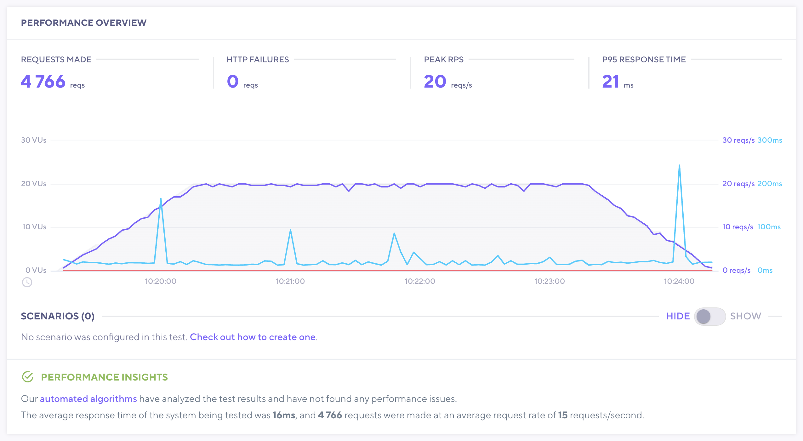
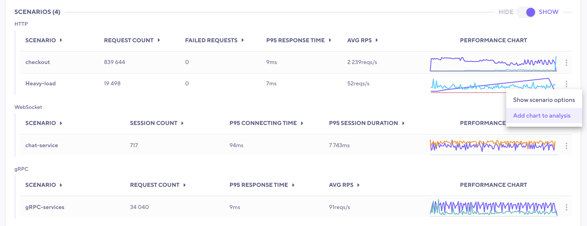

## Background

As part of the k6 Cloud offering, k6 Cloud Results enables you to visualize, store, analyze, and trend your test results. All tests that utilize k6 Clouds Results will be analyzed by our [Performance Insights](./02%20Performance%20Insights) algorithms to detect patterns associated with performance issues.

As you continue to use k6 Cloud Results, we will also automatically create trending graphs so that you can keep track of how performance of your system changes over time. This is helpful for identifying creeping performance issues before they become larger problems.

## Test Navigation and Metadata

The top of the page provides a breadcrumb menu and an overview of details about your test.

The breadcrumb menu allows to quickly navigate between the latest runs of the test, the test page or all the tests in the current project.

Additionally, you can see metadata about the current test. Status, Duration, VUs, Regions used, and who started a test. To the right, you have various buttons and menus to let you re-run, share, compare, configure, or delete your test.

## Performance Overview

The Performance Overview section displays high level data for your test. While the test is running live metrics are displayed.

After the test has finished the section is updated to no longer show stats that were ony relevant while monitoring a live test.

If there are any scenarios configured in the test script, a report with high level data for each individual scenario will show up right below the main performance overview chart. In this script there were no explicit scenarios configured.

If any performance Insights have been detected, we will also display that information to you. In this test, our algorithms did not find any problems.

The first signal of a good or bad result will generally be in the Performance Overview panel. Here are the most common patterns to consider.

Typical signs of a good result:

- Response time has a flat trend for the duration of the test
- Request rates follow the same ramping pattern as Virtual Users (if VUs increase, so does the request rate)

Typical signs of a performance issue/bottleneck:

- Response times rise during the test
- Response times rise, then quickly bottom out and stay flat
- Request rates do not rise with VUs (and response times start to increase)

This is a non-exhaustive list. You should use these patterns as a first indicator of good or bad performance of your test.

## Scenarios

This section shows high level data for each individual scenario that was configured in the test script. The overview data is grouped per protocol to make comparison and analysis easier.\
Here is an example of a test that was configured to generate traffic using HTTP, WebSocket and gRPC.

## Result Tabs

The Result tabs allow you to dig into the specific result data sets from your test. We present the following tabs to organize your result data:

| Tab Name   | Definition                                                                                     | Add to analysis? | Filtering        | Sorting                 |
| ---------- | ---------------------------------------------------------------------------------------------- | ---------------- | ---------------- | ----------------------- |
| Thresholds | List of your Thresholds in the order they are defined in your script (if used).                | Yes              | Yes              | In order defined        |
| Checks     | List of Checks, organized into Groups (if used).                                               | Yes              | Yes              | By scenario/group, or list (all) |
| HTTP       | List of HTTP requests made, organized into Groups (if used).                                   | Yes              | Yes              | By scenario/group, or list (all) |
| WebSocket  | List of Websocket requests made, organized into groups (if used).                              | Yes              | Yes              | By scenario/group, or list (all) |
| gRPC       | List of invoked gRPC methods, organized into groups (if used).                                 | Yes              | Yes              | By scenario/group, or list (all) |
| Analysis   | Tab used to compare data for analysis                                                          | N/A              | N/A              | N/A                     |
| Script     | Script used to run your test (k6 cloud tests only)                                             | N/A              | N/A              | N/A                     |
| Logs       | Logs that were generated by test script (see [docs for logs](/cloud/analyzing-results/logs/))  | N/A              | Yes              | N/A                     |

These tabs let you dig into your test data in a visual and error-driven way. You are able to click on any metric to expand a graph and dig deeper. You can also add these graphs to the Analysis tab. This allows you to look for interesting correlations in your result data. Within each tab note the &#10003; or &#10005; next to the individual metrics if failures were encountered. In the example below, we have two checks with apparent failures.

## Analysis

The Analysis tab enables you to analyze and compare metrics. This is helpful for viewing very specific pieces of your data and finding correlations. Added metrics will first appear as a small chart. You can change your aggregation or select Filters to visualize the data in different ways. Finally, you can use the `+` to add the data to the large chart for comparison.

Here are some general tips to consider when adding metrics and using this tab:

- Ensure that VUs and Request rate follow the same trend
- Add and compare interesting requests from the HTTP and Websocket tabs to compare with other metrics
- Add the load generator CPU and Memory consumption metrics to ensure they are not saturated (metrics are only available for tests run in the cloud)
- Add thresholds that have been exceeded
- Add checks that have failures
- Add metrics for endpoints that you have specific SLAs/SLOs on

The above list is meant as a starting point in helping you identify performance related issues.

## See Also

- [Performance Insights](/cloud/analyzing-results/performance-trending)
- [Thresholds](/cloud/analyzing-results/threshold-tab)
- [Checks](/cloud/analyzing-results/checks-tab)
- [HTTP Table](/cloud/analyzing-results/http-tab)
- [Analysis and Comparison Tab](/cloud/analyzing-results/test-comparison)
