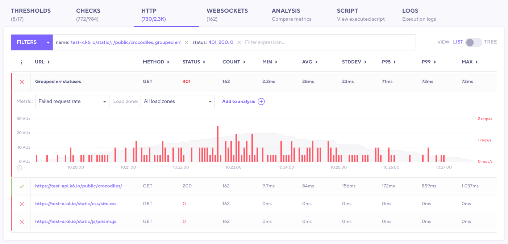

## Cloud Results: HTTP Tab

The HTTP Tab allows you to inspect individual HTTP requests made in your test. The number in the tab represents total passing HTTP Requests / total HTTP Requests. This provides a quick hint to any failing requests. Displayed in the tab will be a row for each HTTP request by resource, by test scenario, method used, status code returned. If an endpoint has multiple request methods or status codes, we separate them.
In our example here we have applied a filter to the list to only show a set of the result, this can be particularly useful when analyzing the result.

On this tab, we can easily see `HTTP` requests that have failures. Take notice of the &#10003; on the left of each row. If we had failures they would be marked with a &#10005;

When you click on a row to expand, you can also:

- View additional metrics for the request
- Some options also allow changing of aggregation
- Add the chart (plus additional metrics) to the Analysis tab

The HTTP tab can be displayed in two separate "display modes", list layout and tree layout. The list view displays a flat list of entries aggregating "similar entries (with same value for labels name, status, method, expected_response)" while the tree view visually groups entries by the scenario and group the request was executed.

The columns that are displayed in the results table is customizable, columns can be hidden or added (choose from a fixed set of fields). Selecting which ones to display can be changed by clicking the "vertical ellipsis" icon left of the URL column.

