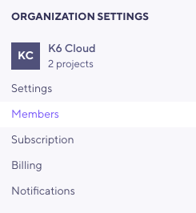
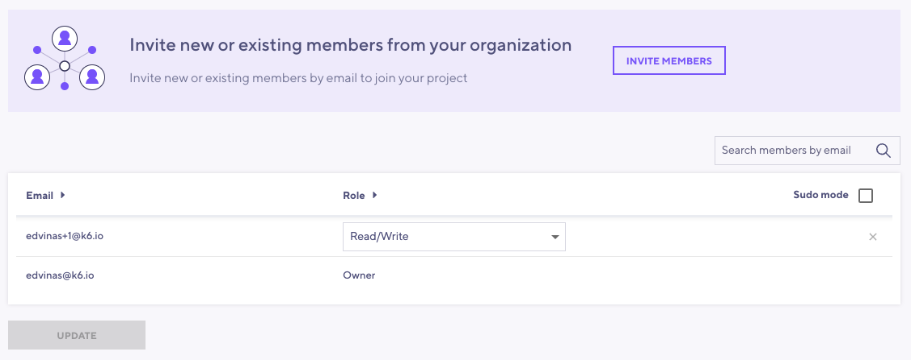
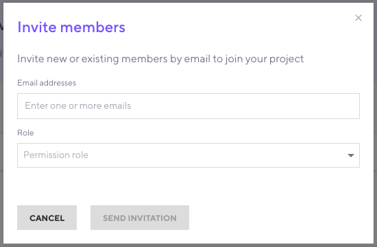

> <b>Project members must specify a project id when runnings tests from a CLI</b>
> 
> If you're running tests from a CLI you must specify a `projectID` in `options.ext.loadimpact.projectID` in order to use the subscription of the Organization you have been invited to. You can find an example [here](/cloud/project-and-team-management/project-members/#specify-a-projectid).

## Background

Project members functionality allows you to invite users to gain access to your project and subscription within the k6 Cloud app. This makes it easy to collaborate and share results between key stakeholders across your company. You can grant either [Read/Write](/cloud/project-and-team-management/project-members/#read-write) or [Read-only](/cloud/project-and-team-management/project-members/#read-write) access to a project.

## Access to a project

When inviting a user to a project you can assign them one of the two access types: [Read/Write](/cloud/project-and-team-management/project-members/#read-write) or [Read-Only](/cloud/project-and-team-management/project-members/#read-only).

### Read/Write

This access type gives a project member the ability to create, edit, run and schedule tests in a particular project.

### Read-Only

Read-Only access type gives a project member the ability only to view tests and test runs in a particular project, not being able to modify them in any way.

## Managing project members

There are two places in the k6 Cloud app where you can manage members - [Members tab](/cloud/project-and-team-management/project-members/#members-tab) under the **Organization settings** or through [Project settings](/cloud/project-and-team-management/project-members/#project-settings). 

### Members tab

To locate **Members tab** click on **Members** link under the **Organization Settings** sub-menu in the top left corner.



Under the **Members tab** you will be able to invite new members to projects under your organization, change access levels or delete currently existing members.


To add new project members click on `Invite new members` button. 


Then, within the modal, enter email addresses and select what kind of permission role you want to assign.<br />
There are two types of permission roles:

- `Project member` - this role is suitable for cases when you don't want to grant the ability to edit organization or project settings. 
You can choose what kind of access type you want to grant to your selected projects - [Read/Write](/cloud/project-and-team-management/project-members/#read-write) or [Read-Only](/cloud/project-and-team-management/project-members/#read-only).
- `Admin` - users with this role will be able to see and edit all the projects under your organization, manage members and change the majority of organizations settings. 

### Project settings

To locate this view click on the **Project settings** link located in the project dashboard near the `Create new test` button.


In the **Project settings** view you will be able to invite new members, change access levels or delete currently existing members from your selected project. 



To add new project members click on `Invite members` button.



Here you will be able to specify email addresses and the permission role you want to assign to your currently selected project.

> `Role` field will only let you choose between [Read/Write](/cloud/project-and-team-management/project-members/#read-write) or [Read-Only](/cloud/project-and-team-management/project-members/#read-only)
> access types, as this view operates under the context of the currently selected project. If you want to set a member as an admin please refer to [Members tab](/cloud/project-and-team-management/project-members/#members-tab) section.

## Specify a projectID

<CodeGroup labels={[]}>

```javascript
export const options = {
  // Truncated for brevity
  ext: {
    loadimpact: {
      name: 'My Test Name',
      projectID: 1234567, // Replace with your projectID
      distribution: {
        scenarioLabel1: { loadZone: 'amazon:us:ashburn', percent: 50 },
        scenarioLabel2: { loadZone: 'amazon:ie:dublin', percent: 50 },
      },
    },
  },
};
```

</CodeGroup>
